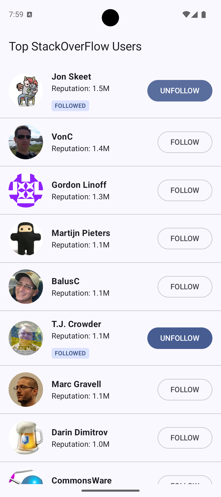

# Top StackOverFlow Users App
An Android app that displays the top 20 StackOverFlow users sorted by reputation.
The app also allows to follow and unfollow users, this is only simulated by persisting locally the follow status.



## Features implemented
- Fetching and displays of the top 20 StackOverflow users sorted by reputation.
- Showing a loading indicator during network requests.
- Error state in case of errors during network calls, offering a retry button.
- In the loaded state, each list item shows the user's profile image, display name and the formatted reputation.
- Simulated follow/unfollow actions persist state locally so that it is persisted across sessions.
- Followed users contain an extra tag.

## Installation requirements
* **JDK:** 17 or higher
* **Emulator or device:** `minSdk` is set to API 29 (Android 10) so the app must be run at least on Android 10.

## How to install the app
To build and install via the command line, use the Gradle wrapper from the root directory:

```bash
./gradlew installDebug
```
or
```bash
./gradlew app:installDebug
```
Alternatively you can open the project in Android Studio and use the `app` run configuration.

## How to run the tests
The app has extensive unit test coverage. You can run the test suite from command line with:
```bash
./gradlew test
```
Alternatively you can run test on Android Studio by right click on `src/test` and selecting to run all tests.

## Technical decisions

### Architecture Overview
This application follows **Clean Architecture** principles to separate concerns and to keep the codebase testable and maintainable. The architecture is divided into three distinct layers:

**Domain Layer:** The innermost layer. It contains pure Kotlin business logic (`StackOverflowUser`, `GetTopUsersUseCase`, `FollowUserUseCase` and `UnfollowUserUseCase`). It doesn't contain dependencies to the Android framework or specific data implementations.
**Data Layer:** Implements the repository interfaces defined in the domain layer. It combines data fetching from the remote API (using `Retrofit` for the list of users) and local storage (using `DataStore` for the set of followed users).
**Presentation Layer:** Implements the MVVM pattern and presents data in the UI using Jetpack Compose.

In the code the layers are separated in respective packages:
- `presentation` depends on `domain`
- `domain` does not depend on neither `presentation` nor `domain`
- `data` depends on `domain`

### How the data flows
This app implements the Unidirectional Data Flow (UDF) pattern. UI events are passed down to the ViewModel and UseCases, while the data layer merges local and remote sources to push state back up to the presentation layer via Kotlin Flow.

```text
┌─────────────────────────────────────────────────────────┐
│                 Compose UI Screen                       │
│             (TopStackOverflowUsersScreen)               │
└─────────────────────────────────────────────────────────┘
│                                           ▲
│ 1. Events                                 │ 8. StateFlow<TopUsersUiState>
│    (load, follow, unfollow)               │    (Loading, Success, Error)
▼                                           │
┌─────────────────────────────────────────────────────────┐
│                    ViewModel                            │
│               (UserListViewModel)                       │
└─────────────────────────────────────────────────────────┘
│                                           ▲
│ 2. Executes UseCase                       │ 7. Flow<List<StackOverflowUser>>
▼                                           │
┌─────────────────────────────────────────────────────────┐
│                      Domain                             │
│     (GetTopUsersUseCase / FollowUserUseCase)            │
└─────────────────────────────────────────────────────────┘
│                                           ▲
│ 3. Calls Repository                       │ 6. Flow<List<StackOverflowUser>>
▼                                           │
┌─────────────────────────────────────────────────────────┐
│                    Repository                           │
│        (UsersRepository ➔ UsersRepositoryImpl)          │
└─────────────────────────────────────────────────────────┘
│                 │                         ▲
│ 4. Fetch Users  │ 5. Read Follows         │ 6. combine() Streams
▼                 ▼                         │
┌────────────┐   ┌──────────────┐           │
│  Retrofit  │   │   DataStore  │───────────┘
│  (Network) │   │   (Local)    │
└────────────┘   └──────────────┘
```

### Gradle project structure
Currently, the codebase contains a single Gradle module (`:app`). If the app were to grow with new features (e.g., Authentication, User Profile), these features should be extracted into independent feature modules.

### How is local follow/unfollow system implemented
To fulfill the requirement of simulating a follow/unfollow system without using backend APIs, the app immediately updates the UI upon interaction and persists that state across app sessions.

I opted for `DataStore` preferences to handle this because it provides a lightweight, reactive way to store simple key value pairs (like a `Set<Int>` of followed user account ids). Adding `Room` for this feature would introduce unnecessary boilerplate, as the data does not require complex relational queries.

### Libraries used
**UI**: Jetpack Compose

**Concurrency**: Coroutines, Flow, StateFlow

**Networking**: Retrofit, OkHttp, Kotlin serialization

**DI**: Hilt

**Image loading**: Coil

**Persistency**: DataStore

**Testing**: Mockito, `kotlinx-coroutines-test`, Truth
